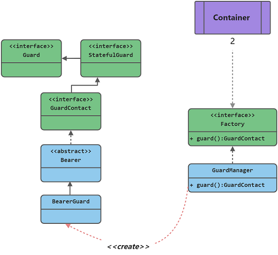

### Bearer Auth



> 此项目基于 `Laravel` 开发,参考了内置的 guard 实现了一套自定义的守卫器
>
> 守卫器基于 `redis` 存储，不再依赖数据库，使用简单
>
> 已实现了中间件过滤拦截，登录，注销功能

### 使用前准备
- 安装 reids,并安装 redis 扩展

### 引入包

```shell
composer require xgbnl/bearer
```

### 发布至项目

```shell
php artisan bearer:install
```

### 使用

- 编辑.env
```dotenv
REDIS_HOST=redis
REDIS_PASSWORD=123456
REDIS_PORT=6379
```

- 编辑中间件 `app/Http/Kernel.php`

```php
use Xgbnl\Bearer\Middleware\BearerAuthorization;

protected $routeMiddleware = [
    // ....
    'guard' => BearerAuthorization::class,
];

 ```

- 为路由添加守卫

```php 
Route::middleware('guard:user')->get('/user',fn(Request $req) => $req->user());
```

### 写在最后

为确保功能正常使用，`bearer.php` 配置文件中的提供者模型需要实现 `Xgbnl\Bearer\Contracts\Authenticatable` 接口,这里我的 `trati` 已经实现了该接口的方法，你应该像下面这样配置你的模型:

```php
use Xgbnl\Bearer\Contracts\Authenticatable;
use Xgbnl\Bearer\Traits\HasApiToken;

class User implements Authenticatable
{
    use HasApiToken;
}
```

### 更详细说明

- 使用登录功能
> guard 辅助函数会返回一个守卫实例，`login` 函数实现了用户登录的具体逻辑，并返回一个`access_token`

```php
public function login()
{
    // Get input parameter
    $validated = $this->validate();

    // Get user
    $user = User::query()->where('email',$validated['email'])->first();

    // Validate ....

    // Auto login
    $guard = guard('user')->login($user);

    return json($guard);
}

```

- 使用注销
> 使用前提，用户必须为登录的情况下，否则抛出异常
```php

guard('user')->logout();

```


更多配置请查看 `config/bearer.php`