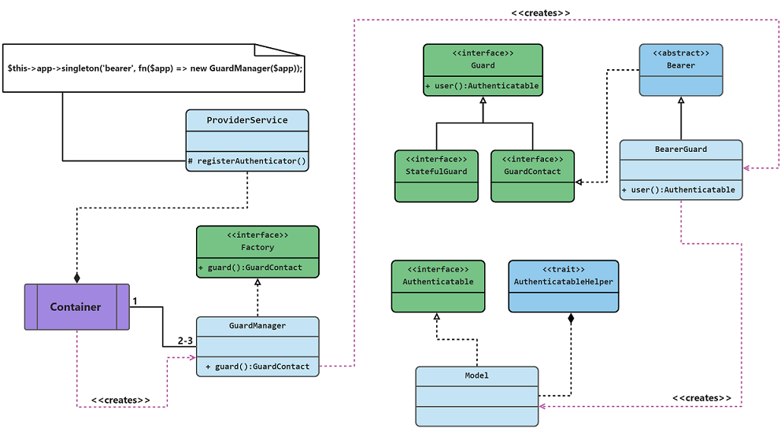

### Bearer Auth

> 此项目基于 `Laravel` 开发 , `redis` 存储令牌

### 架构图



### 请安装以下扩展

- redis
- pecl-http

### 引入包

```shell
composer require xgbnl/bearer
```

### 发布配置文件

```shell
php artisan bearer:publish
```

### 使用

- 编辑.env

```dotenv
REDIS_HOST=redis
REDIS_PASSWORD=123456
REDIS_PORT=6379
```

- 编辑中间件 `app/Http/Kernel.php`

```php
use Xgbnl\Bearer\Middleware\BearerAuthorization;

protected $routeMiddleware = [
    // ....
    'guard' => BearerAuthorization::class,
];

 ```

- 为路由添加守卫

```php 
Route::middleware('guard:user')->get('/user',fn(Request $req) => $req->user());
```

### 写在最后

为确保功能正常使用，`bearer.php` 配置文件中的提供者模型需要实现 `Xgbnl\Bearer\Contracts\Authenticatable` 接口,这里我的 `trati`
已经实现了该接口的方法，你应该像下面这样配置你的模型:

```php
use Xgbnl\Bearer\Contracts\Authenticatable;
use Xgbnl\Bearer\Traits\AuthenticatableHelpers;

class User implements Authenticatable
{
    use AuthenticatableHelpers;
}
```

### 更详细说明

- 使用登录功能

> guard 辅助函数会返回一个守卫实例，`login` 函数实现了用户登录的具体逻辑，并返回一个`access_token`

```php
public function login()
{
    // Get input parameter
    $validated = $this->validate();

    // Get user
    $user = User::query()->where('email',$validated['email'])->first();

    // Validate ....

    // Auto login
    $token = guard('user')->login($user);
    
    // Get user permission
    $permission = $user->permission;

    return json(['permission' => $permission,'token'=>$token]);
}

```

- 使用注销

> 使用前提，用户必须为登录的情况下，否则抛出异常

```php
guard('user')->logout();
```

## 扩展中间件

> 一旦涉及到隐私、金钱、密码之类的操作，必须要再次验证身份。包里提供两种保护方式，根据实际业务去调整

- 通过校验`ip`地址
- 通过校验设备信息

创建一个`FilterMiddleware`

```shell
php artisan make:middleware FilterMiddleware
```

**继承 `Xgbnl\Bearer\Middleware\Authorization`,并实现 `doHandle()方法`**

```php

use Xgbnl\Bearer\Middleware\Authorization;

class FilterMiddleware extends Authorization
{
    public function doHandle(){
    
    // TODO: Implement doHandle() method.
        
        // 本次访问IP与上次记录IP不一致时
        if ($this->guard()->validateClientIP()){
        
            // .... 进行设备验证逻辑 
            
            // 或者抛出异常
        }
        
        // 本次访问的设备与上次不一致时
        if ($this->guard()->validateDevice()){
            // 验证操作或抛出异常
        }
    }
}
```

